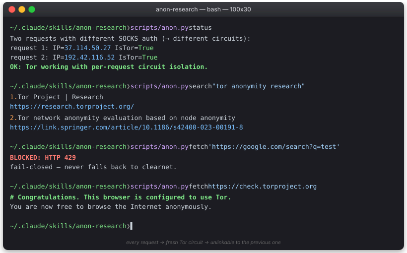
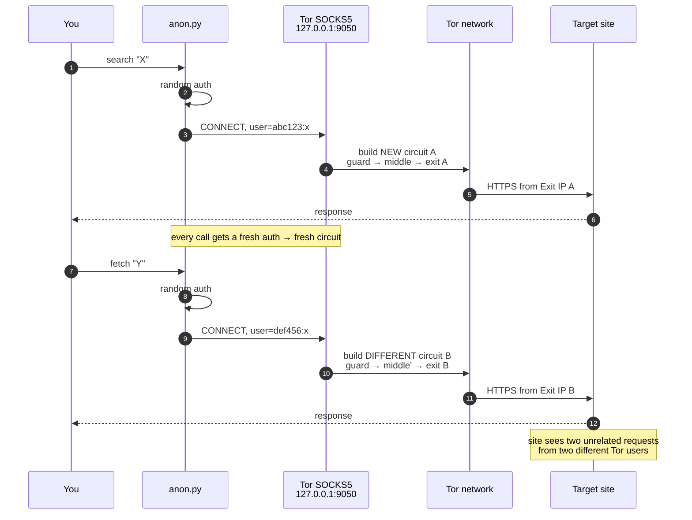

<div align="center">

# anon-research

**Anonymous internet research, one Tor circuit per request.**

A Claude Code skill for searching and fetching the web through Tor, with **per-request stream isolation** so target sites can't link two of your requests as coming from the same source — let alone back to you.



</div>

---

## Why this exists

The web tools that ship with Claude Code are great, but none of them are *private*:

| Tool | Anonymous? | JS rendering | Notes |
|---|:--:|:--:|---|
| `WebSearch` (built-in) | ❌ | ✅ | Goes through Anthropic |
| `firecrawl` | ❌ | ✅ | Tied to your Firecrawl API key |
| `enterprise-search` | n/a | n/a | Internal docs only |
| **`anon-research`** | ✅ | ❌ | This skill — Tor + circuit isolation |

If you're researching something where the *act of asking* is sensitive — competitor intel, a medical question, a legal topic, a security investigation — none of the above hide you from the destination site. This skill does.

## How it works

Every search and every fetch is shelled out to `curl` with a *unique random SOCKS5 auth pair* against the local Tor daemon. Tor's default `IsolateSOCKSAuth` policy treats different auth as different streams, which means **a brand-new circuit (different guard, middle, and exit relays) for each request**.



The trick in one line:

```bash
curl --proxy socks5h://$(openssl rand -hex 8):x@127.0.0.1:9050 ...
#                       └──────────────────┘
#                       random per call → new circuit
```

The `socks5h` (with `h`) sends DNS through Tor too, so your ISP's resolver never sees the hostnames you visit either.

## Quick start

```bash
# One-time setup — installs Tor (Homebrew on macOS; prints package-manager
# instructions on Linux) and starts the daemon. Idempotent.
~/.claude/skills/anon-research/scripts/anon.py setup

# Prove it works — two requests should report different exit IPs:
~/.claude/skills/anon-research/scripts/anon.py status

# Use it:
~/.claude/skills/anon-research/scripts/anon.py search "your query"
~/.claude/skills/anon-research/scripts/anon.py fetch  https://example.org/article
```

Or just talk to Claude — phrases like *"search anonymously for X"*, *"private research on Y"*, or *"fetch this page without being tracked"* trigger the skill via its description keywords.

## Commands

### `setup`
Detects platform, installs Tor if missing (`brew install tor` on macOS; prints `apt`/`dnf`/`pacman` hint on Linux; otherwise links to https://www.torproject.org/download/), starts the daemon, verifies connectivity. Idempotent — safe to re-run.

### `status`
Makes two requests to `check.torproject.org/api/ip` with different SOCKS auth and prints both IPs. Both must say `IsTor: true` **and the IPs must differ** — that's the proof your two requests aren't correlatable by exit IP.

### `search QUERY [--limit N] [--json]`
DuckDuckGo HTML search through Tor. Tries DDG's `.onion` service first (search traffic stays inside the Tor network — *no exit relay sees your query*) and falls back to the clearnet HTML mirror over Tor if the onion is unreachable. Both routes are full-Tor; the fallback isn't a privacy regression. Returns markdown list of `{title, url, snippet}` — or JSON with `--json`.

### `fetch URL [--format markdown|text|html]`
GETs URL through Tor with a fresh circuit. Default output is readable markdown.

If the fetch hits a Tor block (Cloudflare challenge, HTTP 403/429/451, common captcha bodies), it prints `BLOCKED:` with the reason and exits 2 — **never silently falls back to clearnet**. Silent fallback would deanonymize you.

## Privacy properties

| Property | How |
|---|---|
| Hide your IP from target sites | All traffic via Tor SOCKS5 |
| Hide DNS lookups from your ISP | `socks5h://` (DNS resolves *inside* Tor) |
| Two requests can't be linked by exit IP | Random SOCKS auth per call → fresh circuit (`IsolateSOCKSAuth`) |
| No cookies linking requests across calls | curl invoked without `-b`/`-c`; no session jar |
| No `Referer` leakage | Header never sent |
| No Tor Browser fingerprint mimicry | Generic Firefox-on-Linux UA — a common, low-signal choice |
| HTTPS-only | HTTP URLs print a warning before sending |
| No silent clearnet fallback | Block detection + `BLOCKED:` + exit 2 |

## Limitations

- **No JavaScript** — `curl`-based; SPAs and JS-heavy sites don't render. For those, use `firecrawl` and accept the privacy tradeoff.
- **Many sites block Tor exits** — Cloudflare, Google, news paywalls. Returns `BLOCKED`. Try a different source, or re-run for a fresh exit.
- **Don't authenticate** — Logging into anything from this skill destroys the anonymity property. Just don't.
- **Slower than direct HTTP** — Building a fresh Tor circuit adds 5–15 seconds per request. That's the privacy/speed tradeoff this skill makes deliberately.
- **Your ISP can see you're using Tor** — Just not what you're doing. Bridges/pluggable transports are out of scope for v1.

## Repo layout

```
anon-research/
├── README.md           ← this file
├── SKILL.md            ← Claude Code frontmatter + invocation docs
├── assets/
│   └── demo.svg        ← terminal demo embedded above
└── scripts/
    └── anon.py         ← the CLI (stdlib only, shells out to curl)
```

Zero pip-installable dependencies. Just **Python 3**, **`curl`**, and a running **Tor**.

## Verification log

<details>
<summary><b>Real output captured during install + verification</b></summary>

```text
$ scripts/anon.py setup
==> Checking for tor binary…
    not found. Platform: Darwin
==> Installing Tor via Homebrew (this can take a minute)…
==> Pouring tor--0.4.9.6.arm64_tahoe.bottle.tar.gz
🍺  /opt/homebrew/Cellar/tor/0.4.9.6: 26 files, 31.2MB
==> Successfully started `tor` (label: homebrew.mxcl.tor)
==> Verifying Tor connectivity…
    OK. Tor ready on 127.0.0.1:9050 (exit IP: 37.228.129.241)

$ scripts/anon.py status
Two requests with different SOCKS auth (→ different circuits):
  request 1: IP=37.114.50.27   IsTor=True
  request 2: IP=192.42.116.52  IsTor=True
OK: Tor working with per-request circuit isolation.

$ scripts/anon.py fetch https://check.torproject.org/ | head -2
# Congratulations. This browser is configured to use Tor.
You are now free to browse the Internet anonymously.

$ scripts/anon.py fetch 'https://www.google.com/search?q=test'; echo "exit: $?"
BLOCKED: https://www.google.com/search?q=test
  reason: HTTP 429
  HTTP status: 429
  This skill is fail-closed — never falls back to clearnet.
exit: 2
```

In one full session we observed four distinct Tor exit IPs across just five requests:
`37.228.129.241`, `37.114.50.27`, `192.42.116.52`, `185.220.101.54`. Stream isolation is doing its job.

</details>

## Installing on a fresh machine

```bash
mkdir -p ~/.claude/skills
git clone <this-repo> ~/.claude/skills/anon-research
chmod +x ~/.claude/skills/anon-research/scripts/anon.py
~/.claude/skills/anon-research/scripts/anon.py setup
```

Claude Code auto-discovers anything under `~/.claude/skills/`. After install, the skill activates automatically when you ask Claude to research something privately.

## Threat model — what this *doesn't* protect against

Be honest about scope:

- **Active deanonymization by a global passive adversary** correlating Tor entry and exit traffic. Mitigation: out of scope.
- **Browser fingerprinting** (canvas, fonts, WebGL). N/A — no browser involved here.
- **You typing your real name into a search query.** This is on you.
- **Logged-in services.** Don't do it.
- **Tor exit nodes reading plaintext.** That's why HTTPS is enforced.

This skill is a tool for *unlinkable, IP-anonymous research from the perspective of target sites and your ISP* — nothing more, nothing less.
